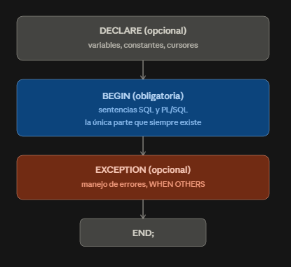
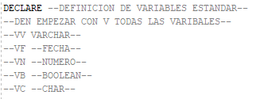
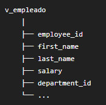
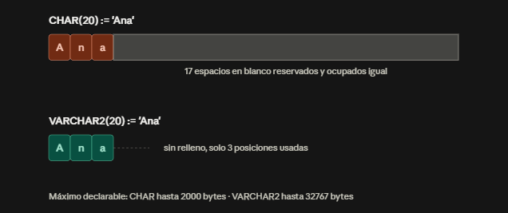

### Bloque PL/SQL

Todo el trabajo que va a ejecutar un programa se define por cuatro palabras claves



### PL/SQL VS SQL

> SQL: SQL solo no alcanza para programas complejos. SQL es declarativo (dices qué quieres, no cómo), pero no tiene IF, no tiene bucles, no puede guardar un valor en una variable y reutilizarlo.

> PL/SQL = Procedural Language / SQL. Es Oracle metiéndole a SQL las herramientas de un lenguaje de programación normal: variables, condicionales, bucles, manejo de errores.

### ¿Para qué sirve?

<table>
  <thead>
    <tr>
      <th>Elemento</th>
      <th>Qué es</th>
    </tr>
  </thead>
  <tbody>
    <tr>
      <td>Procedimientos almacenados</td>
      <td>un "programa" guardado dentro de la base</td>
    </tr>
    <tr>
      <td>Funciones</td>
      <td>igual, pero devuelve un valor</td>
    </tr>
    <tr>
      <td>Triggers</td>
      <td>código que se dispara solo cuando algo pasa (un INSERT, por ejemplo)</td>
    </tr>
    <tr>
      <td>Scripts</td>
      <td>bloques sueltos para tareas puntuales</td>
    </tr>
  </tbody>
</table>


### UNIDADES LÉXICAS

>DELIMITADOR: 
Es un símbolo simple o compuesto que tiene una función especial en PL/SQL.
Estos pueden ser:
<br>• Operadores Aritméticos
<br>• Operadores Lógicos
<br>• Operadores Relacionales

Ejemplo:
> ; , + -

>IDENTIFICADOR: 
Son empleados para nombrar objetos de programas en PL/SQL así como a
unidades dentro del mismo, estas unidades y objetos incluyen:
<br>• Constantes
<br>• Cursores
<br>• Variables
<br>• Subprogramas
<br>• Excepciones
<br>• Paquetes


>LITERAL: 
Es un valor de tipo numérico, carácter, cadena o lógico no representado por un
identificador (es un valor explícito)

> COMENTARIOS: 
de línea simple y multilínea:

```sql
-- Línea simple
```

```sql
/*
Conjunto de Líneas
*/
```
### Variables y tipo de datos

Ejemplo:
Estructura de variables que siempre se debe usar 



También puedes especificar precisión y escala:

```sql
saldo NUMBER(16,2);
```
> Se utiliza NUMBER(16,2) para representar 14 dígitos enteros y 2 decimales.

>Oracle redondea los decimales sobrantes en silencio, pero NUNCA recorta dígitos enteros. Si el entero no cabe, es un error duro, no un truncamiento silencioso.
ERROR:

>ORA-01438: value larger than specified precision allows for this column

Constantes:
```sql
PI CONSTANT NUMBER := 3.1416;
```
> CONSTANT obliga a inicializar la constante y que su valor no puede modificarse.
```sql
v_edad NUMBER := 20;
v_edad := 21;
```
una variable no puede quedar en NULL:
```sql
v_nombre VARCHAR2(30) NOT NULL := 'Isabela';
```
EL SIGNO ":="

> El operador := se usa para asignar un valor, mientras que = se usa para comparar la igualdad

> := (Asignación): Asigna un valor a una variable o parámetro. Guarda la información dentro del espacio de memoria de la variable.

> = (Comparación o Asignación): En consultas SQL estándar (WHERE col = val), evalúa si dos expresiones son iguales (devuelve verdadero o falso). 

### Definicion de tipo de datos automatico(%TYPE y %ROWTYPE)

%TYPE

```sql
DECLARE
  nombre paises.nom_pais%TYPE;    
BEGIN
  SELECT nom_pais INTO nombre FROM paises WHERE cod_pais = 3;
  dbms_output.put_line('El país es: ' || nombre);
END;
```

> Aquí %TYPE es un truco muy usado: en vez de escribir VARCHAR2(30) a mano y arriesgarte a que un día la tabla cambie de tipo y tu variable se desactualice, le dices "sé del mismo tipo que esa columna".


%ROWTYPE

```sql
v_empleado employees%ROWTYPE;
```


> %ROWTYPE obtiene los tipos de todos los campos de una tabla, vista o cursor.


### SELECT ... INTO


```sql
DECLARE
    v_nombre employees.first_name%TYPE;

BEGIN

    SELECT first_name
    INTO v_nombre
    FROM employees
    WHERE employee_id = 100;

END;
```

1. El SELECT first_name FROM employees WHERE employee_id = 100; busca el nombre del empleado con el ID 100.
2. Al encontrarlo (por ejemplo, "Steven"), la instrucción INTO v_nombre toma ese valor y lo guarda dentro de la variable v_nombre que declaraste arriba.

>NOTA: Debe devolver exactamente una fila: Si el SELECT no encuentra ningún registro (NO_DATA_FOUND) o si devuelve más de una fila (TOO_MANY_ROWS), el programa fallará con un error a menos que captures la excepción.

❌ MAL

```sql
DECLARE
    v_nombre employees.first_name%TYPE; 
BEGIN

    SELECT first_name, last_name, salary 
    INTO v_nombre 
    FROM employees
    WHERE employee_id = 100;

END;
```
>LANZA UN ERROR --> PLS-00394: wrong number of values in the INTO list of a SELECT statement

> Si pides 3 campos, necesitas 3 variables separadas por comas.
Si pides 1 campo, necesitas 1 variable.

Varios campos con SELECT INTO

```sql
DECLARE
    v_nombre VARCHAR2(20);
    v_apellidos VARCHAR2(20);
    v_edad NUMBER;

BEGIN

    SELECT nombre, apellidos, edad
    INTO v_nombre, v_apellidos, v_edad
    FROM estudiante
    WHERE identificacion = 10;

END;
```

### DBMS_OUTPUT.PUT_LINE

DBMS son paquetes de oracle, se puede decir que son como librerias

EJEMPLO:

```sql
DBMS_OUTPUT.PUT_LINE();

DBMS_OUTPUT.PUT_LINE('Nombre: ' || v_nombre);
```

> || --> sirve para concatenar 

>En otra evidencia se explicara más sobre DBMS y lo que ofrece


### EJEMPLO COMPLETO


```sql
DECLARE
    v_nombre employees.first_name%TYPE;
    v_salario employees.salary%TYPE;

BEGIN

    SELECT first_name, salary
    INTO v_nombre, v_salario
    FROM employees
    WHERE employee_id = 100;

    DBMS_OUTPUT.PUT_LINE('Nombre: ' || v_nombre);
    DBMS_OUTPUT.PUT_LINE('Salario: ' || v_salario);

END;
```

### Operadores de PL/SQL

<table>
  <thead>
    <tr>
      <th>Tipo</th>
      <th>Operadores</th>
      <th>Para qué</th>
    </tr>
  </thead>
  <tbody>
    <tr>
      <td>Asignación</td>
      <td>:=</td>
      <td>Guardar un valor</td>
    </tr>
    <tr>
      <td>Aritméticos</td>
      <td>+ - * / **</td>
      <td>Operaciones</td>
    </tr>
    <tr>
      <td>Relacionales</td>
      <td>= &lt;&gt; &lt; &gt; &lt;= &gt;=</td>
      <td>Comparar</td>
    </tr>
    <tr>
      <td>Lógicos</td>
      <td>AND OR NOT</td>
      <td>Combinar condiciones</td>
    </tr>
    <tr>
      <td>Concatenación</td>
      <td>||</td>
      <td>Unir cadenas de texto</td>
    </tr>
  </tbody>
</table>

### bloque anónimo vs subprograma(PROCEDURE)

> Bloque anónimo (no tiene nombre, se ejecuta una sola vez, no queda guardado en la base):

```sql
DECLARE
  v_location VARCHAR2(15) := 'Granada';
  PI CONSTANT NUMBER := 3.1416;
  v_nombre tabla_empleados.nombre%TYPE;
  reg_datos micursor%ROWTYPE;
BEGIN
  -- ejecución
EXCEPTION
  -- manejo de errores
END;
```

> Subprograma (procedimiento con nombre, se guarda permanentemente en la base de datos):

```sql
CREATE PROCEDURE simple_procedure IS
  v_location VARCHAR2(15) := 'Granada';
  PI CONSTANT NUMBER := 3.1416;
BEGIN
  -- ejecución
EXCEPTION
  -- manejo de errores
END;
```
> La diferencia real no es la sintaxis interna (son casi idénticos) — es que el bloque anónimo se ejecuta y se olvida, mientras el procedimiento queda compilado y almacenado en el diccionario de datos, listo para llamarse muchas veces (EXEC simple_procedure;).

> 🟣 El bloque anónimo se ejecuta como un bloque sin nombre.
🔵 El procedimiento es un programa PL/SQL con nombre que se almacena en Oracle.

### PREGUNTAS 

1. ¿Por qué BEGIN...END es la única sección obligatoria de un bloque PL/SQL, y DECLARE/EXCEPTION no lo son?

BEGIN...END es obligatoria porque es la única sección que contiene acción real (lo que la máquina ejecuta). DECLARE solo prepara nombres y EXCEPTION solo atrapa errores si ocurren — ninguna de las dos hace que el bloque "haga" algo por sí sola. Un bloque sin declaraciones ni excepciones sigue siendo un programa válido; sin BEGIN...END no hay programa.

2. ¿Qué diferencia hay entre = y := en PL/SQL? ¿En qué sección de un bloque usarías cada uno?

el = permite compararar entre dos variables o dos valores, algo similar a lo que se hace con WHERE D.DEPARTMENT_ID = E.DEPARTMENT_ID.en cambio, := es para asignar un valor a una varible tal como VV_dato = 'Hola' 

3. Tienes esta declaración: descuento NUMBER(4,2) NOT NULL; — ¿qué está mal aquí y cómo lo corregirías?

descuento NUMBER(4,2) NOT NULL; está mal porque NOT NULL exige que la variable tenga un valor inicial obligatorio (no puede arrancar en NULL, que es el comportamiento por defecto de toda variable no inicializada). Aquí no hay ningún :=, así que Oracle no tiene con qué inicializarla y da error de compilación.

correccion: 

```sql
descuento NUMBER(4,2) NOT NULL := 0;
```

4. Declara una variable que herede el tipo exacto de la columna email de una tabla CLIENTE, sin saber (ni necesitar saber) si es VARCHAR2(50) o VARCHAR2(100).

```sql
DECLARE
  v_email cliente.email%TYPE;
BEGIN
  SELECT email
  INTO v_email
  FROM cliente
  WHERE id = 001;
END;

```


5. Un compañero declara codigo_producto CHAR(10) para guardar códigos como 'A1', 'B23', 'C005' (longitud variable, entre 2 y 5 caracteres). Tú le sugieres cambiarlo a VARCHAR2(10). ¿Qué problema concreto le estás evitando, y en qué se notaría ese problema si comparara dos códigos con =?



Se corrige cambiando el tipo de dato de CHAR(10) a VARCHAR2(10), porque VARCHAR2 no rellena con espacios en blanco, evitando así que las comparaciones con = fallen por diferencias de longitud entre los valores.


6. Estás escribiendo un bloque que va a recorrer con un cursor todas las columnas de la tabla MOVIMIENTO (son 12 columnas). ¿Usarías 12 variables con %TYPE cada una, o una sola variable con %ROWTYPE? Justifica pensando en mantenibilidad, no solo en que "funcione".

crea una sola variable-registro cuya estructura interna tiene un campo por cada columna de la tabla (reg.col1, reg.col2, etc.), en un solo DECLARE. Con 12 columnas, la alternativa de %TYPE obligaría a escribir 12 líneas de declaración y, peor aún, si la tabla MOVIMIENTO gana una columna nueva mañana, tendrías que editar el código a mano. Con %ROWTYPE el bloque se ajusta automáticamente.

7. Mira este bloque y dime qué error(es) de sintaxis tiene, señalando la línea:

```sql
DECLARE
  v_saldo NUMBER(8,2);
  PI CONSTANT NUMBER;
BEGIN
  v_saldo = 500.00;
  v_edad NUMBER := 30;
END
```
Hay cuatro errores:
En esta linea PI CONSTANT NUMBER; ya que al ser una varibale constante debe estar definida con algun valor de manera obligatoria 

En esta linea v_edad NUMBER := 30; ya que del bloque BEGIN se estan declarando las varibales, y como no cumple con la estructura de Oracle, esto indicara un error

En esta linea  v_saldo = 500.00;  el error esta en "=" ya que para asignar debe ser con :=, el igual sirve para comparar mas no para asignar

En la linea del END no contiene ";" 

8. ¿Qué diferencia real de comportamiento (no solo de sintaxis) hay entre un bloque anónimo y un procedimiento almacenado cuando los ejecutas dos veces en una misma sesión?

El bloque anónimo se compila y ejecuta una vez; termina y no queda nada guardado en la base, si lo vuelves a necesitar, hay que reescribirlo/reenviarlo entero. El procedimiento almacenado (CREATE PROCEDURE ...) se compila una sola vez y queda guardado en el diccionario de datos de Oracle; después puedes invocarlo cuantas veces quieras en la misma sesión (o en otras) con EXEC nombre_procedimiento;, sin reenviar el código fuente.

9. Trabajas en el banco del taller (Banco Andino 🏦). Te piden declarar una variable para guardar el saldo de una cuenta, sabiendo que los saldos van desde -$500.000 (sobregiros permitidos) hasta $999.999.999,99. ¿Qué NUMBER(p,s) usarías exactamente, y por qué elegiste esos dos números y no otros?

utilizaria NUMBER(11,2) esto se debe a que como su valor limite previene datos si son de este tamaño, y si son pequeños no habria problema con el espacio asignado, en cambio, si este tamaño fuera meenor y el saldo excediera ese tamaño lanzaria un error, produciendo fallos de consistencia, asi que es mejor prevenir autizando el espacio minimo a que lance un error por exceder el tamaño establecido en NUMBER(p,s)