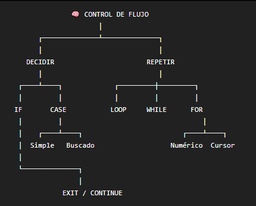

>IF y CASE sirven para decidir.
LOOP, WHILE y FOR sirven para repetir.

### Concepto 

<table>
  <thead>
    <tr>
      <th>Familia</th>
      <th>¿Para que sirve?</th>
      <th>Ejemplos</th>
    </tr>
  </thead>
  <tbody>
    <tr>
      <td>Selección</td>
      <td>Tomar decisiones</td>
      <td>IF, CASE</td>
    </tr>
    <tr>
      <td>Iteración</td>
      <td>Repetir</td>
      <td>LOOP, WHILE, FOR</td>
    </tr>
    <tr>
      <td>Secuencial</td>
      <<td>Alterar/dejar explícito el flujo</td>
      <td>GOTO, NULL</td>
    </tr>
    
  </tbody>
</table>

> EXIT y CONTINUE modifican el comportamiento dentro de los bucles.

¿DONDE SE PONDE ESTO?

```sql
DECLARE
    -- variables
BEGIN
    -- AQUÍ van IF, CASE, LOOP, FOR, WHILE...
EXCEPTION
    -- manejo de errores
END;
/
```
> Las sentencias de control van en la sección ejecutable, es decir, después de BEGIN.

### IF

> Tomar decisiones según una condición 

1. ¿Para qué sirve?

Permite ejecutar instrucciones solamente cuando se cumple una condición.


2. Estructura:

IF THEN

```sql
IF v_nota >= 3 THEN
    v_estado := 'APROBADO';
END IF;
```

IF THEN ELSE

```sql
IF v_nota >= 3 THEN
    v_estado := 'APROBADO';
ELSE
    v_estado := 'REPROBADO';
END IF;
```

IF + ELSIF

```sql
IF v_nota >= 4 THEN
    v_nivel := 'ALTO';

ELSIF v_nota >= 3 THEN
    v_nivel := 'MEDIO';

ELSE
    v_nivel := 'BAJO';
END IF;

```

> NOTA: el cierre del if es END IF

<table>
  <thead>
    <tr>
      <th>Tipo</th>
      <th>Estructura</th>
      <th>Ejemplos</th>
    </tr>
  </thead>
  <tbody>
    <tr>
      <td>estructura simple (estructura simple)</td>
      <td>IF condicion THEN
            instruccion;
          END IF;
             </td>
      <td>IF, CASE</td>
    </tr>
    <tr>
      <td>Iteración</td>
      <td>Repetir</td>
      <td>LOOP, WHILE, FOR</td>
    </tr>
    <tr>
      <td>Secuencial</td>
      <<td>Alterar/dejar explícito el flujo</td>
      <td>GOTO, NULL</td>
    </tr>
    
  </tbody>
</table>

> En PL/SQL una condición no tiene solamente TRUE O FALSE, tambien tiene NULL, llamandose lógica de tres valores.

POR EJEMPLO:

```sql
v_nota := NULL;
```

```sql
IF v_nota = NULL THEN
    DBMS_OUTPUT.PUT_LINE('Es NULL');
END IF;
```
❌ ESTO NO ES VERDADERO (TRUE).

-------------------------------------------------------------


<table>
  <thead>
    <tr>
      <th>❌ Incorrecto: </th>
      <th> ✅ Correcto:</th>
    </tr>
  </thead>

  <tbody>
    <tr>
      <td>```sql
          v_nota = NULL 
          ```
        </td>
      <td>```sql
          v_nota = NULL 
          ```
          </td>
    </tr>

  </tbody>
</table>

### CASE SIMPLE

CASE también sirve para tomar decisiones.

Pero normalmente es muy cómodo cuando estás preguntando:

> "Según este mismo dato, ¿qué corresponde?"

```sql
CASE v_jornada

    WHEN 'D' THEN
        v_txt := 'Diurna';

    WHEN 'N' THEN
        v_txt := 'Nocturna';

    ELSE
        v_txt := 'Sin definir';

END CASE;
```
Visualmente:

              v_jornada
                  │
        ┌─────────┼─────────┐
        ▼         ▼         ▼
       'D'       'N'      otro
        │         │         │
        ▼         ▼         ▼
     Diurna    Nocturna  Sin definir

> Se llama: CASE simple
Porque compara un selector contra diferentes valores.

### CASE buscado

> Ahora no estás comparando directamente un valor, sino condiciones.

```sql
CASE

    WHEN v_nota >= 4 THEN
        v_txt := 'Alto';

    WHEN v_nota >= 3 THEN
        v_txt := 'Medio';

    ELSE
        v_txt := 'Bajo';

END CASE;
```


ES PARECIDO A:

```sql
IF v_nota >= 4 THEN
    ...
ELSIF v_nota >= 3 THEN
    ...
ELSE
    ...
END IF;
```

EN OTRAS PALABRAS

> 🟣 CASE simple --> ¿Este valor es D, N, A...?
> 🔵 CASE buscado --> ¿Se cumple esta condición?

### Sentencia CASE ≠ expresión CASE

Aunque ambas se llaman CASE, son diferentes.

🟣 Sentencia CASE

```sql
CASE
    WHEN v_n >= 3 THEN
        v_estado := 'APROBADO';

    ELSE
        v_estado := 'REPROBADO';
END CASE;
```

🟣 Expresión CASE

```sql
v_estado := CASE
                WHEN v_n >= 3 THEN 'APROBADO'
                ELSE 'REPROBADO'
            END;
```

### LOOP

> Es el bucle más "manual".

```sql
v_i := 1;

LOOP

    DBMS_OUTPUT.PUT_LINE('Iteración ' || v_i);

    v_i := v_i + 1;

    EXIT WHEN v_i > 5;

END LOOP;
```

SALIDA:

```text 
Iteración 1
Iteración 2
Iteración 3
Iteración 4
Iteración 5
```

> El EXIT es fundamental.
Sin EXIT WHEN v_i > 5; podri quedar en un bucle infinito 

> el LOOP básico ejecuta el cuerpo al menos una vez, porque la condición de salida se evalúa dentro del cuerpo.

### WHILE

> WHILE pregunta primero: ¿Se cumple la condición?

Si sí → entra. 

```sql
v_saldo := 1000;

WHILE v_saldo > 0 LOOP

    v_saldo := v_saldo - 250;

END LOOP;
```

DIFERENCIA FUNDAMENTAL:

LOOP --> entra mínimo 1 vez
WHILE --> puede entrar 0 veces

### FOR

> Quiero repetir X cantidad de veces.

EJEMPLO

```sql
FOR i IN 1..5 LOOP

    DBMS_OUTPUT.PUT_LINE(i);

END LOOP;
```

### FOR REVERSE

```sql
FOR i IN REVERSE 1..5 LOOP
    DBMS_OUTPUT.PUT_LINE(i);
END LOOP;
```
Los límites siguen escribiéndose:

```sql
1..5
```
> El REVERSE es lo que hace que se recorra al revés.

### FOR sobre CURSOR

```sql
SELECT id_estudiante, nombre, nota
FROM ctl_estudiante;
```

> Quieres recorrer cada fila.

puede hacer:


```sql
FOR r IN (
    SELECT id_estudiante, nombre, nota
    FROM ctl_estudiante
    WHERE nota IS NOT NULL
) LOOP

    DBMS_OUTPUT.PUT_LINE(
        r.nombre || ' -> ' || r.nota
    );

END LOOP;

```

### EXIT Y CONTINUE

> Son modificadores de los bucles.

EXIT 🚪

Significa:

> "Sal del bucle."

EJEMPLO:

```sql
EXIT WHEN v_i > 5;
```

CONTINUE ⏭️

Significa:

> "No hagas lo que queda de esta vuelta; pasa a la siguiente."


```sql
FOR i IN 1..10 LOOP

    CONTINUE WHEN MOD(i, 2) = 0;

    DBMS_OUTPUT.PUT_LINE(i);

END LOOP;
```

🚨Una trampa con CONTINUE

```sql
v_i := 1;

LOOP

    CONTINUE;

    v_i := v_i + 1;

END LOOP;
```

El CONTINUE hace que nunca llegue a v_i := v_i + 1;

> Bucle infinito.
Es riesgo en un LOOP básico.

### GOTO y NULL 

> Estos casi no se utilizan.

GOTO:

> Permite saltar a una etiqueta:

```sql
GOTO fin;

<<fin>>
NULL;
```

NULL 

> Aquí NULL significa:
"No hago nada intencionalmente."

EJEMPLO:

```sql
CASE v_tipo

    WHEN 'A' THEN
        procesar_a;

    WHEN 'B' THEN
        procesar_b;

    ELSE
        NULL;

END CASE;
```

Es diferente de:
- NULL como valor
- NULL es una sentencia que explícitamente no hace nada.

> una operación masiva puede hacerse con BULK COLLECT + FORALL, y que si el problema puede resolverse directamente con SQL, un único UPDATE puede ser preferible.

### ¿Cómo sé cuál usar en un ejercicio?

> IF

<table>
  <thead>
    <tr>
      <th>Estuctura</th>
      <th>En que caso</th>
      <th>Ejemplo</th>
    </tr>
  </thead>
  <tbody>
  <tr>
      <th>IF</th>
      <th>SI ocurre X → hacer Y</th>
      <th>Si el salario es mayor a 5000, mostrar "alto".</th>
    </tr>
    <tr>
      <td>CASE simple</td>
      <td>Si hay varias opciones del mismo dato</td>
      <td>Si jornada = D → Diurna; N → Nocturna; otro → Sin definir.</td>
    </tr>
    <tr>
      <td>CASE buscado o IF ELSIF</td>
      <td>Si hay varias condiciones</td>
      <td>Si nota ≥ 4 alto; ≥ 3 medio; menor bajo.</td>
    </tr>  
  </tbody>
</table>

> FOR

<table>
  <thead>
    <tr>
      <th>Estuctura</th>
      <th>En que casos</th>
      <th>Ejemplo</th>
    </tr>
  </thead>
  <tbody>
    <tr>
      <td>FOR</td>
      <td>Si sabes cuántas veces repetir</td>
      <td>Mostrar los números del 1 al 10.</td>
    </tr>
    <tr>
      <td>WHILE</td>
      <td>Si quieres repetir mientras se cumpla algo</td>
      <td>Mientras haya saldo... (WHILE v_saldo > 0 LOOP)</td>
    </tr>
    <tr>
      <td>LOOP</td>
      <td>Si necesitas controlar manualmente cuándo termina</td>
      <td>LOOP...
             EXIT WHEN ...;
          END LOOP;</td>
    </tr>
    <tr>
      <td>FOR sobre cursor</td>
      <td>Si quieres recorrer filas de una consulta</td>
      <td>FOR r IN (SELECT ...)
          LOOP
            ...
          END LOOP;</td>
    </tr>
    
  </tbody>
</table>

### ERRORES QUE DEBO TENER PRESENTE


<table>
  <thead>
    <tr>
      <th>Error</th>
      <th>¿Qué significa?</th>
    </tr>
  </thead>
  <tbody>
    <tr>
      <td>ORA-06592</td>
      <td>CASE no encontró coincidencia y no había ELSE</td>
    </tr>
    <tr>
      <td>PLS-00363</td>
      <td>Intentaste modificar el índice de un FOR</td>
    </tr>
    <tr>
      <td>Bucle infinito</td>
      <td>LOOP sin salida o CONTINUE mal ubicado</td>
    </tr>
    <tr>
      <td>Bucle no ejecuta</td>
      <td>Variable NULL o límites invertidos</td>
    </tr>
    <tr>
      <td>Condición nunca funciona</td>
      <td>Usaste = NULL en lugar de IS NULL</td>
    </tr>
  </tbody>
</table>
