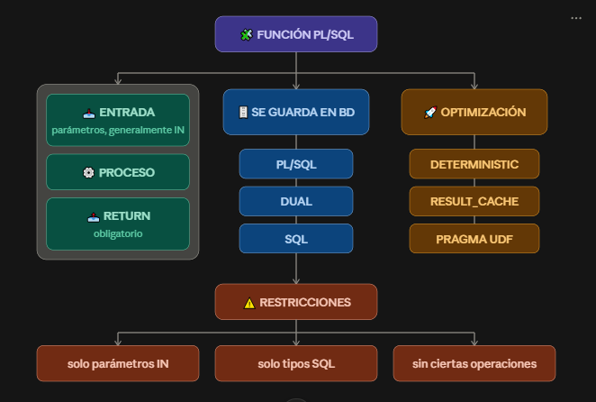

### ¿Qué es una función?

Una función es un bloque de código que:
📥 recibe datos → ⚙️ realiza un procesamiento → 📤 devuelve un valor

> La diferencia importante con un bloque anónimo es que la función queda guardada en la base de datos y puede reutilizarse.

### Función vs procedimiento vs bloque anónimo

<table>
  <thead>
    <tr>
      <th>Característica</th>
      <th>Bloque anónimo</th>
      <th>Función</th>
      <th>Procedimiento</th>
    </tr>
  </thead>
  <tbody>
    <tr>
      <td>Se guarda en BD</td>
      <td>❌</td>
      <td>✅</td>
      <td>✅</td>
    </tr>
    <tr>
      <td>Devuelve un valor</td>
      <td>❌</td>
      <td>✅ Obligatorio</td>
      <td>❌</td>
    </tr>
    <tr>
      <td>Se puede llamar desde SQL</td>
      <td>❌</td>
      <td>✅ Con restricciones</td>
      <td>❌</td>
    </tr>
    <tr>
      <td>Se reutiliza</td>
      <td>❌</td>
      <td>✅</td>
      <td>✅</td>
    </tr>
    <tr>
      <td>Uso típico</td>
      <td>🧪 Probar</td>
      <td>🧮 Calcular</td>
      <td>⚙️ Ejecutar acciones</td>
    </tr>
  </tbody>
</table>

> una función normalmente calcula, formatea o valida, mientras que un procedimiento se utiliza más para registrar, actualizar u orquestar acciones.

PARA RECORDAR:

¿Necesito CALCULAR algo?             
        ↓
      FUNCIÓN 🧮

¿Necesito HACER algo?
        ↓
   PROCEDIMIENTO ⚙️

Por ejemplo:

nota_definitiva(...)
        ↑
   sustantivo
        ↓
     FUNCIÓN


registrar_matricula(...)
        ↑
      verbo
        ↓
   PROCEDIMIENTO

### Estructura de una función

La estructura básica es:

```sql
CREATE OR REPLACE FUNCTION nombre_funcion (
    parametros
)
RETURN tipo_de_dato
IS
    -- variables
BEGIN
    -- instrucciones

    RETURN valor;
END nombre_funcion;
/
```
EJEMPLO:

```sql
CREATE OR REPLACE FUNCTION fn_nota_definitiva (
    p_corte1 IN NUMBER,
    p_corte2 IN NUMBER,
    p_corte3 IN NUMBER DEFAULT 0
)
RETURN NUMBER
IS
    c_peso_final CONSTANT NUMBER := 0.4;
    v_nota NUMBER(3,2);
BEGIN
    v_nota := ROUND(
        p_corte1 * 0.3 +
        p_corte2 * 0.3 +
        p_corte3 * c_peso_final,
        2
    );

    RETURN v_nota;
END fn_nota_definitiva;
/
```

### Parámetros

Los parámetros son los datos que entran a la función.

significa:

p_corte1
   │
   ├── nombre del parámetro
   │
   └── IN → entra a la función


> Se recomienda utilizar parámetros IN, especialmente porque una función utilizada desde SQL necesita cumplir determinadas restricciones.

### Parámetros con DEFAULT
Podemos darle un valor predeterminado a un parámetro:

```sql
p_corte3 IN NUMBER DEFAULT 0
```
Eso significa:

> Si quien llama la función no proporciona p_corte3, Oracle utiliza 0.

EJEMPLO: 

```sql
fn_nota_definitiva(3.5, 4.0)
```
Oracle interpreta:

```text
p_corte1 = 3.5
p_corte2 = 4.0
p_corte3 = 0
```
> 📌 Regla: los parámetros que tienen DEFAULT deben ir al final.


### ¿Cómo llamamos una función?

1. Posicional

> El orden de los parámetros importa:
```sql
fn_nota_definitiva(3.5, 4.0, 2.8);
```
Oracle interpreta:

```text
3.5 → p_corte1
4.0 → p_corte2
2.8 → p_corte3
```

2. Notación nombrada

> Indicamos explícitamente qué valor corresponde a cada parámetro:
```sql
fn_nota_definitiva(
    p_corte1 => 3.5,
    p_corte2 => 4.0
);
```
> Esto es especialmente útil cuando queremos omitir parámetros que tienen DEFAULT.

3. Mixta
Primero parámetros posicionales y después nombrados:

```sql
fn_nota_definitiva(
    3.5,
    p_corte3 => 2.8,
    p_corte2 => 4.0
);
```

MAPA MENTAL: 

              LLAMAR FUNCIÓN
                    │
          ┌─────────┼─────────┐
          ▼         ▼         ▼
      Posicional  Nombrada   Mixta
          │         │         │
       importa    importa   primero
       el orden   el nombre posicional
                           ↓
                        nombrada


### RETURN
> Una función debe devolver un valor.


```sql
RETURN NUMBER ---> ¿Qué tipo de dato devuelve?
RETURN v_nota ---> ¿Qué valor devuelve?

```

NOTA:
```sql
RETURN NUMBER(3,2)
```
❌ No es correcto en la firma de la función.

DEBE SER:
```sql
RETURN NUMBER
```

### Toda ruta debe terminar en RETURN
```sql
IF p_nota >= 3 THEN
    RETURN 'APROBADO';
END IF;
```

¿Qué pasa si:
```sql
p_nota = 2.5
```
❓ No entra al IF.

Puede producir:
```text
ORA-06503
Function returned without a value
```
> esto ocurre en ejecución cuando una ruta termina sin ejecutar RETURN.

### ¿Dónde queda guardada la función?

Cuando hacemos:
```sql
CREATE OR REPLACE FUNCTION ...
```

Oracle guarda:
```text
📄 Código fuente
       +
⚙️ Código compilado
       ↓
🗄️ Base de datos
```

### ¿Qué significa que una función esté INVALID?

Si una funion utiliza la tabla estudiante y se modifica esa tabla, eso provoca que cambie por lo que la funcion queda INVALID. Oracle puede intentar recompilarla cuando se vuelva a utilizar.

Pero si la recompilación falla:

INVALID
   ↓
se intenta recompilar
   ↓
❌ falla
   ↓
error al ejecutar

> Por eso es importante revisar el estado antes de asumir que todo está bien.

### ¿Cómo saber por qué no compila?

Después de crear una función:
```sql
SHOW ERRORS
```
También podemos consultar:
```sql
SELECT line, position, text
FROM user_errors
WHERE name = 'FN_NOTA_DEFINITIVA'
ORDER BY sequence;
```
Y revisar el estado:
```
SELECT object_name, status, last_ddl_time
FROM user_objects
WHERE object_type = 'FUNCTION';
```
> Hay que mirar estos errores en lugar de adivinar qué está fallando.

### ¿Dónde puedo utilizar una función?

Una función puede utilizarse:

🟢 Dentro de SQL
```sql
SELECT fn_nota_definitiva(c1, c2, c3)
FROM fn_nota;
```
🟢 Dentro de PL/SQL
```sql
v_definitiva :=
    fn_nota_definitiva(3.5, 4.0, 2.8);
```
🟢 Directamente para probarla
```
SELECT fn_nota_definitiva(3.5, 4.0, 2.8)
FROM dual;
```

### Una función dentro de un SELECT tiene un costo

si se tiene
```sql
SELECT fn_nota_definitiva(c1, c2, c3)
FROM fn_nota;
```
Si se tienen 100.000 filas 

Además, existe un cambio de contexto entre:

🟦 Motor SQL
     ↕
🟧 Motor PL/SQL


IDEA CLAVE:

SQL
 │
 │ llama
 ▼
PL/SQL
 │
 │ devuelve
 ▼
SQL

> Ese cambio repetido puede afectar el rendimiento.

### ¿Cuándo una función puede utilizarse desde SQL?

Debe:

✅ utilizar parámetros IN

✅ utilizar tipos de datos SQL

❌ no utilizar BOOLEAN, RECORD o colecciones PL/SQL como parámetros/retorno para esa llamada SQL

❌ no ejecutar determinadas operaciones como COMMIT, ROLLBACK o DDL dentro de la función invocada desde una consulta.

### DETERMINISTIC

```sql
### DETERMINISTIC

```

significa que estamos prometiendo:

📌 Con las mismas entradas, la función siempre devuelve el mismo resultado.

EJEMPLO:
```sql
fn_limpia_nombre('isabela')
```
siempre debería devolver:
```text
ISABELA
```

EJEMPLO ESTRUCTURADO:
```sql
CREATE OR REPLACE FUNCTION fn_limpia_nombre (
    p_nombre IN VARCHAR2
)
RETURN VARCHAR2 DETERMINISTIC
IS
BEGIN
    RETURN UPPER(TRIM(p_nombre));
END;
/
```

### RESULT_CACHE

```sql
RESULT_CACHE
```

La idea:

Si ya calculé un resultado y puedo reutilizarlo, Oracle puede conservarlo en caché.

Visualmente

Sin caché:

Solicitud 1 → 🧮 calcula → resultado
Solicitud 2 → 🧮 calcula → resultado
Solicitud 3 → 🧮 calcula → resultado

Con caché:

Solicitud 1 → 🧮 calcula → 💾 CACHE
                              │
Solicitud 2 ──────────────────┤
Solicitud 3 ──────────────────┤
                              ▼
                         reutiliza

Es especialmente útil cuando tenemos datos que:
1. se consultan mucho
2. cambian poco
3. tienen resultados que vale la pena reutilizar

> Los cambios frecuentes en las tablas pueden invalidar las entradas del caché.

### PRAGMA UDF

El problema

```sql
SQL ↔ PL/SQL
```
Cuando una función se utiliza principalmente desde SQL, podemos utilizar:
```sql
PRAGMA UDF;
```

EJEMPLO:
```sql
CREATE OR REPLACE FUNCTION fn_iva(
    p_valor IN NUMBER
)
RETURN NUMBER
IS
    PRAGMA UDF;
BEGIN
    RETURN ROUND(p_valor * 0.19, 2);
END;
/
```
> PRAGMA UDF permite optimizar la función para invocaciones desde SQL.

### Excepciones dentro de funciones

Una función también puede manejar errores:

```sql
EXCEPTION
    WHEN NO_DATA_FOUND THEN
        RETURN NULL;

    WHEN TOO_MANY_ROWS THEN
        RAISE_APPLICATION_ERROR(
            -20001,
            'Identificador duplicado'
        );
```

Ejemplo conceptual:

SELECT ... INTO ...
       │
       ├── encuentra 1 fila
       │       ↓
       │    RETURN
       │
       ├── no encuentra
       │       ↓
       │  NO_DATA_FOUND
       │
       └── encuentra varias
               ↓
        TOO_MANY_ROWS


> NO_DATA_FOUND es como una excepción que debe manejarse explícitamente.

### AUTHID - ¿con qué privilegios se ejecuta?

Una función puede ejecutarse bajo diferentes privilegios.

1. AUTHID DEFINER

Es el valor predeterminado.

USUARIO A
   │
   │ llama función
   ▼
FUNCIÓN
   │
   ▼
privilegios del dueño

2. AUTHID CURRENT_USER

Utiliza los privilegios del usuario que está llamando.

USUARIO A
   │
   │ llama
   ▼
FUNCIÓN
   │
   ▼
privilegios de A

### Funciones dentro de paquetes

> Una función también puede formar parte de un PACKAGE.

Tenemos:

📦 PACKAGE
│
├── 📄 SPECIFICATION
│      ↓
│   contrato público
│
└── ⚙️ BODY
       ↓
   implementación

EJEMPLO:

```sql
CREATE OR REPLACE PACKAGE BODY pk_notas IS

    FUNCTION definitiva(
        p1 NUMBER,
        p2 NUMBER,
        p3 NUMBER
    ) RETURN NUMBER IS
    BEGIN
        RETURN ROUND(
            p1*.3 + p2*.3 + p3*.4,
            2
        );
    END;

END pk_notas;
/
```
> La ventaja es que podemos modificar la implementación sin afectar necesariamente a quienes dependen de la especificación.

### Errores frecuentes

<table>
  <thead>
    <tr>
      <th>Error</th>
      <th>¿Qué significa?</th>
      <th>Solución</th>
    </tr>
  </thead>
  <tbody>
    <tr>
      <td>PLS-00103</td>
      <td>Error de sintaxis</td>
      <td>Revisar declaración</td>
    </tr>
    <tr>
      <td>ORA-06503</td>
      <td>La función terminó sin RETURN</td>
      <td>Garantizar RETURN</td>
    </tr>
    <tr>
      <td>ORA-14551</td>
      <td>DML dentro de función usada desde SQL</td>
      <td>Revisar diseño</td>
    </tr>
    <tr>
      <td>INVALID</td>
      <td>El objeto necesita recompilarse</td>
      <td>Revisar dependencias</td>
    </tr>
    <tr>
      <td>Consulta lenta</td>
      <td>Función ejecutada muchas veces</td>
      <td>Considerar SQL puro / optimización</td>
    </tr>
  </tbody>
</table>

### MAPA MENTAL ESTRUCTURAL



### idea final

FUNCIÓN
```sql
FUNCIÓN = recibe → procesa → devuelve
```

Diferencia con procedimiento
```sql
FUNCIÓN       → devuelve un valor 🧮
PROCEDIMIENTO → realiza una acción ⚙️
```

Estructura

```sql
CREATE OR REPLACE FUNCTION
...
RETURN tipo
IS
...
BEGIN
...
RETURN valor;
END;
/
```

REGLAS:
```text
✅ RETURN es obligatorio
✅ Una función devuelve un solo valor
✅ Parámetros IN para uso desde SQL
✅ RETURN NUMBER, no RETURN NUMBER(3,2)
✅ DEFAULT permite omitir un parámetro
✅ DEFAULT al final
✅ SHOW ERRORS ayuda a diagnosticar
```

Rendimiento:

SQL → función → SQL
       ↕
   cambio de contexto

Si se ejecuta muchas veces:

```text
⚠️ puede ser costoso
```

> considerar primero SQL puro, y luego herramientas como PRAGMA UDF o RESULT_CACHE cuando correspondan.

### Preguntas teoricas


### Ejercicios practicos


