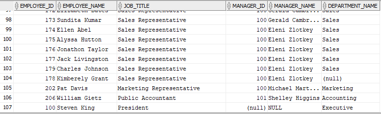

En este espacio se presentan los ejercicios realizados y resueltos durante las clases. Posteriormente, podrá consultar los ejercicios en formato PDF para una visualización más detallada y completa del trabajo realizado.

<a href="/archivos/taller_repaso_SQL_Avanzado_HR.pdf" download>
  Descargar PDF
</a>


### 6.1 Verificación de casos borde del esquema
Columnas obligatorias: caso_borde, empleados_afectados, descripcion

Debe devolver exactamente cuatro filas: empleado sin jefe, empleado sin departamento,
empleados sin comisión y departamentos sin empleados.

• Estos cuatro casos son los que hacen fallar las consultas de los bloques siguientes.
Identificarlos primero es parte de la evaluación.

SOLUCION 


```sql
SELECT 'Empleado sin jefe' AS caso_borde,
       count(*) AS Empleados_afectados,
       'Empleado que el manager id se encuentra en NULL' AS descripcion
FROM hr.employees E
LEFT JOIN HR.EMPLOYEES M
ON e.manager_id = m.employee_id
WHERE m.employee_id IS NULL

UNION ALL

SELECT 'Empleado sin departamento',
        COUNT(*),
        'Empleado donde el departamento id este en NULL' 
FROM hr.employees E
LEFT JOIN HR.DEPARTMENTS D
ON E.DEPARTMENT_ID = D.DEPARTMENT_ID
WHERE D.DEPARTMENT_ID IS NULL

UNION ALL

SELECT 'Empleado sin comisión',
        COUNT(*),
        'Empleado donde la comisión este en NULL' 
FROM hr.employees E
WHERE E.Commission_pct IS NULL

UNION ALL

SELECT 'Deparatamento sin empleado',
        COUNT(*),
        'Departamento donde el employee id del empleado este en NULL' 
FROM hr.employees E
RIGHT JOIN HR.DEPARTMENTS D
ON E.DEPARTMENT_ID = D.DEPARTMENT_ID
WHERE E.employee_ID IS NULL
```

```
Como en el ejercicio se piden cuatro filas, se utilizó UNION ALL, que permite unir todos los SELECT y mostrar los resultados de cada uno, obteniendo así las cuatro filas que pide el ejercicio.

También se utilizó COUNT(*) porque este cuenta todas las filas, incluyendo las que tienen valores NULL. En este caso, como se utiliza WHERE para evaluar la condición, se cuentan únicamente los registros que cumplen con ella, que en este caso son los valores NULL. Si se utilizara COUNT(columna), los valores NULL no se contarían, por lo que el resultado sería 0 aunque existan registros con esa columna en NULL.
```


### 6.2 Inventario completo de departamentos

Columnas obligatorias: department_id, department_name, city, country_name,
employee_count, avg_salary

• Deben aparecer todos los departamentos, incluidos los que no tienen ningún empleado.

• employee_count debe mostrar 0 para los departamentos vacíos, no una fila ausente ni el valor 1.

• El comentario debe explicar por qué COUNT(*) produce el valor incorrecto en este caso y qué función lo corrige.

SOLUCIÓN

> No serviria usar count(*) ya que este se ejecuta después de hacer join, y cuenta los NULL por lo que el valor sería 1 y no como 0. En cambio, si solo se pone COUNT(columna) solo cuenta los valores que no sean NULL.

```sql
SELECT D.department_id, 
       D.DEPARTMENT_NAME, 
       L.CITY, 
       C.COUNTRY_NAME,
       COUNT (E.EMPLOYEE_ID) AS EMPLOYEE_COUNT,
       AVG (E.SALARY) AS AVG_SALARY
FROM HR.departments D
LEFT JOIN HR.EMPLOYEES E
ON D.DEPARTMENT_ID = e.department_id
LEFT JOIN HR.LOCATIONS L
ON d.location_id = L.LOCATION_ID
LEFT JOIN HR.COUNTRIES C
ON C.COUNTRY_ID = L.COUNTRY_ID
GROUP BY D.department_id, 
       D.DEPARTMENT_NAME, 
       L.CITY, 
       C.COUNTRY_NAME;

```
### 6.3 Cadena de mando

Columnas obligatorias: employee_id, employee_name, job_title, manager_id, manager_name,
department_name

• El empleado 100 debe aparecer en el resultado con manager_name en nulo.

• El comentario debe indicar qué tipo de reunión se usó y qué ocurre con ese empleado si se usa
INNER JOIN.

SOLUCIÓN

En la siguiente imagen se muestra el empleado 100 con manager_name en NULL. Esto fue posible gracias al uso de CASE, ya que permite establecer una condición: si el valor está vacío, se muestra NULL; de lo contrario, se muestra el nombre del empleado correspondiente. Esta función sirve para controlar qué valor se desea mostrar dependiendo de una determinada condición 



Si se usara INNER JOIN, eliminaría la fila 107, ya que el manager estaría en NULL y no mostraría los valores que no coinciden entre las tablas. Es por ello que se utilizó LEFT JOIN, que permite mostrar la fila que no muestra el INNER JOIN; aunque el manager esté en NULL, mantiene la fila de la tabla izquierda y coloca NULL en los datos de la tabla derecha que no tengan coincidencia. 

```sql
SELECT E.EMPLOYEE_ID,
       E.FIRST_NAME || ' ' || e.last_name AS employee_name,
       J.JOB_TITLE,
       M.MANAGER_ID,
       CASE
           WHEN M.EMPLOYEE_ID IS NULL THEN 'NULL'
           ELSE M.FIRST_NAME || ' ' || M.LAST_NAME
       END AS MANAGER_NAME,
       D.DEPARTMENT_NAME
FROM HR.EMPLOYEES E
LEFT JOIN HR.EMPLOYEES M
ON E.MANAGER_ID = M.EMPLOYEE_ID
LEFT JOIN HR.JOBS J
ON j.job_id = E.JOB_ID
LEFT JOIN HR.DEPARTMENTS D
ON D.DEPARTMENT_ID = E.DEPARTMENT_ID;
```

### 6.4 Contraste entre la condición en ON y la condición en WHERE

Columnas obligatorias: variante, filas_devueltas, explicacion

• Deben ejecutar la misma reunión externa filtrando por salario superior a 10.000, primero en la
cláusula ON y luego en la cláusula WHERE.

• Deben registrar el conteo de filas de cada variante y enunciar en una sola frase la regla general
que se deriva de la diferencia

SOLUCIÓN

La condición en ON mantiene todas las filas de la tabla izquierda (mostrando nulos si no hay coincidencia), mientras que en WHERE elimina los nulos por completo del resultado final

ON
```sql
SELECT 'ON' AS variante,
       COUNT(*) AS filas_devueltas,
       'Conserva las filas de la tabla derecha' AS explicacion
FROM HR.EMPLOYEES E
RIGHT JOIN HR.DEPARTMENTS D
ON e.department_id = D.department_id AND E.SALARY > 10000;
```

WHERE
```sql
SELECT 'WHERE' AS variante,
       COUNT(*) AS filas_devueltas,
       'Elimina los nulos por completo del resultado final.' AS explicacion
FROM HR.EMPLOYEES E
RIGHT JOIN HR.DEPARTMENTS D
ON e.department_id = D.department_id 
WHERE e.salary > 10000;
```

### 6.5 Diagnóstico de nulos y compensación total

Columnas obligatorias: employee_id, last_name, department_id, salary, commission_pct,
total_compensation, es_jefe

• total_compensation no puede ser nulo para ningún empleado.

• es_jefe debe indicar explícitamente SI o NO y resolverse con NOT EXISTS.

• El comentario debe explicar por qué la versión con NOT IN sobre la subconsulta de manager_id
devuelve el conjunto vacío, y por qué NOT EXISTS no presenta ese comportamiento

La version con NOT EXISTS permite trabajar con nulos, simplemente verifica si existe o no existe una fila que cumpla la condición. En cambio, NOT IN puede presentar problemas cuando existen valores NULL, debido a la forma en que SQL evalúa estas comparaciones.

El uso del CASE nos permitio cumplir con la segunda condicion para indicar si el empleado es jefe mediante SI o NO. Valida si el id del manager concuerda con el empleado, si es el caso lo agrega como SI, indicando queque es Jefe; en caso contrario, muestra NO

```sql
SELECT E.EMPLOYEE_ID,
       E.LAST_NAME,
       E.DEPARTMENT_ID,
       E.SALARY,
       E.commission_pct,
       E.SALARY + (E.SALARY * NVL(COMMISSION_PCT, 0)) AS total_compensation,
       CASE
         WHEN NOT EXISTS(
            SELECT 1
            FROM HR.EMPLOYEES M
            WHERE M.MANAGER_ID = E.EMPLOYEE_ID
        )
        THEN 'NO'
        ELSE 'SI'
      END AS ES_JEFE
FROM HR.EMPLOYEES E;
```

### 6.6 Agregación con filtrado de grupos

Columnas obligatorias: department_id, department_name, employee_count, avg_salary,
min_salary, max_salary, salary_mass, empleados_recientes

Solo departamentos con más de cinco empleados y salario promedio superior a 6.000.

• empleados_recientes debe contar únicamente a los contratados después del 1 de enero de
2005, sin que ese criterio afecte a employee_count. Debe resolverse con agregación
condicional, no con WHERE.

• El comentario debe justificar por qué el criterio de más de cinco empleados no puede
escribirse en WHERE.

```sql
SELECT D.DEPARTMENT_ID, 
      D.DEPARTMENT_NAME,
      COUNT(E.EMPLOYEE_ID) AS employee_count,
      AVG (E.SALARY) AS PROMEDIO_SALARIO,
      MIN(SALARY) AS min_salary,
      MAX(SALARY) AS max_salary,
      SUM(E.SALARY) AS salary_mass,
      COUNT(CASE 
          WHEN E.HIRE_DATE > TO_DATE('2025-01-01', 'YYYY-MM-DD') THEN E.EMPLOYEE_ID
      END) AS empleados_recientes
FROM HR.EMPLOYEES E 
JOIN HR.DEPARTMENTS D
ON E.DEPARTMENT_ID = D.DEPARTMENT_ID
GROUP BY D.DEPARTMENT_ID,
         d.department_name
HAVING COUNT(E.EMPLOYEE_ID) > 5 AND AVG (E.SALARY) > 6000 ;
```

### 6.7 Comparación de cada empleado contra el promedio de su departamento

Columnas obligatorias: employee_id, last_name, department_id, salary, dept_avg_salary,
diff_vs_avg, pct_vs_avg

• Deben entregar dos versiones equivalentes: una con subconsulta correlacionada y otra con
expresión común de tabla.

• El comentario debe señalar exactamente qué columna produce la correlación y comparar
ambos planes de ejecución obtenidos con EXPLAIN PLAN o AUTOTRACE.

```sql
SELECT E.EMPLOYEE_ID,
       E.LAST_NAME,
       E.DEPARTMET_ID,
       E.SALARY,
      (SELECT E2.EMPLOYEE_ID,
              AVG(E.SALARY) 
       FROM HR.EMPLOYEES E2
       WHERE E.DEPARTMENT_ID = E2.DEPARTMENT_ID
       GROUP BY D.DEPARTMENT_ID
      )AS dept_avg_salary,
       E.SALARY - dept_avg_salary AS diff_vs_avg,
       (E.SALARY - dept_avg_salary / dept_avg_salary * 100) AS pct_vs_avg
FROM HR.EMPLOYEES E;
```


